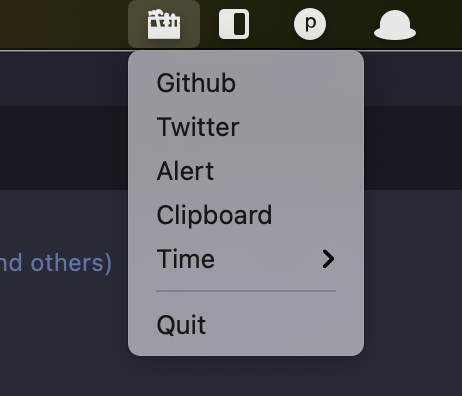

# xtool




## build in win


```bash
rsrc -manifest win.mainfest -ico icon/icon.ico -o rsrc.syso

go build -ldflags="-H windowsgui"
```

## reference

- https://github.com/akavel/rsrc
- https://github.com/getlantern/systray

